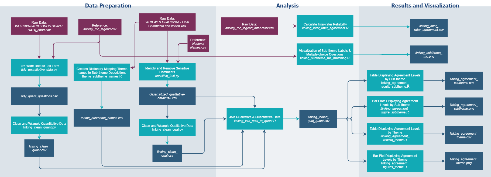

<p align="center">
  <a href="" rel="noopener">
 </a>
</p>

<h3 align="center">BC Stats Text Classification</h3>

---

<p align="center"> As part of the Masters of Data Science Program at UBC, we have partnered with BCStats to analyze their 2018 Work Environment Survey (WES) and to apply natural language processing on the open ended survey responses.
    <br>
</p>

## Table of Contents
- [About](#about)
- [Getting Started](#getting_started)
- [Usage](#usage)
- [Dependencies](#dependencies)
- [Navigating the Repository](#repo)
- [Results](#results)
- [Authors](#authors)
- [References](#references)
- [Acknowledgments](#acknowledgement)

## About <a name = "about"></a>
The BC Stats organization conducts a [Work Environment Survey](https://www2.gov.bc.ca/gov/content/data/statistics/government/employee-research/wes) gathering information from government employees across the BC Public Service. The goal of this survey is to identify areas for improvement and to understand employee engagement. Currently the survey contains ~80 multiple choice questions and one open ended written response. The written response asks the employees "What one thing would you like your organization to focus on to improve your work environment?". The responses are manually classified into 12 broad themes and 68 sub-themes and the aggregated results are reported.


 The focus of this project can be split into two components.
1. Automate the text classification of the written responses using natural language processing.

2. Utilize data science tools to better understand the comments and investigate how they relate to the survey's multiple choice questions.

## Getting Started <a name = "getting_started"></a>
The first step to reproduce this analysis or use the text classification model is to fork the repository. However due to sensitive information and file size limitations you will have to undergo additional steps to make sure you have the required files. The following requirements are needed to reproduce the analysis and use the text classification model.

### Prerequisites

#### Software and packages
```
python
- sklearn
- skmultilearn
- numpy
- pandas
- keras
- matplotlib
- random
- spacy
- re
- nltk
- argparse
- gensim
- networkx
- wordcloud

R
- tidyverse
- foreign
- testthat
```

#### Data  
To fully reproduce the analysis you need the following data files stored on your local computer. These contain sensitive information and require authorization from BC Stats. Please reach out to one of the authors of this repository for more information.
```
- data/raw/2018 WES Qual Coded - Final Comments and Codes.xlsx
- data/raw/WES 2007-2018 LONGITUDINAL DATA.sav
```

To illustrate the project workflow we have provided sanitized sample files in the `data/raw/` directory.

#### Pre-trained embeddings
The text classification model makes use of several pre-trained word embeddings. The required file paths and links to download are provided below. Ensure to unzip the compressed files and have the formats exactly as below before running the keras_embeddings.py script, as this script can take over an hour to run and requires all the embeddings below. 

Word2Vec [1] | Google News [[Link](https://drive.google.com/file/d/0B7XkCwpI5KDYNlNUTTlSS21pQmM/edit)]
```
 - references/pretrained_embeddings.nosync/w2v/GoogleNews-vectors-negative300.bin
```

FastText [2] | Common Crawl | Wikipedia [[Link](https://fasttext.cc/docs/en/english-vectors.html)]
```
- references/pretrained_embeddings.nosync/fasttext/crawl-300d-2M.vec
- references/pretrained_embeddings.nosync/fasttext/wiki-news-300d-1M.vec
```

GloVe [3] | Wikipedia | Common Crawl | Twitter [[Link](https://nlp.stanford.edu/projects/glove/)]
```
- references/pretrained_embeddings.nosync/glove/glove.6B.300d.w2v.txt
- references/pretrained_embeddings.nosync/glove/glove.840B.300d.w2v.txt
- references/pretrained_embeddings.nosync/glove/glove.twitter.27B.200d.w2v.txt
```

In order to use the GloVe embeddings they first need to be converted to w2v format. After downloading them from the link above you need to run the following script at the command line from the project root.
```
python -m gensim.scripts.glove2word2vec -i references/pretrained_embeddings/glove/glove.6B.300d.txt -o references/pretrained_embeddings/glove/glove.6B.300d.w2v.txt

python -m gensim.scripts.glove2word2vec -i references/pretrained_embeddings/glove/glove.840B.300d.txt -o references/pretrained_embeddings/glove/glove.840B.300d.w2v.txt

python -m gensim.scripts.glove2word2vec -i references/pretrained_embeddings/glove/glove.twitter.27B.200d.txt -o references/pretrained_embeddings/glove/glove.twitter.27B.200d.w2v.txt
```

## Usage <a name="usage"></a>
This project contains two separate makefiles, one to reproduce the text classification named `MakefileModel` and another for linking qualitative to quantitative called `MakefileLinking`. The makefiles are designed to be run from the project root through the command line.

**Text Classification**   
To rerun the analysis in full and reproduce the models for prediction:
```
make all -f MakefileModel
```

With the models trained you can quickly make text classifications by running the run_classifier script. Your input_csv needs to be formatted the same as shown in the sample data file `data/raw/wes2018_comments_sample.csv`
```
python src/models/run_classifier.py \
--input_csv FILEPATH_IN
--output_csv FILEPATH_OUT
```

To remove all files associated with this section:
```
make clean -f MakefileModel
```

**Linking Qualitative to Quantitative**  
To rerun the analysis in full and reproduce the results:
```
make all -f MakefileLinking
```

To remove all files associated with this section:
```
make clean -f MakefileLinking
```

## Dependencies <a name="dependencies"></a>
**Text Classification**    


**Linking Qualitative to Quantitative**   


## Navigating the Repository <a name="repo"></a>
The correct folder structure is detailed below with all the directories for this project. Not all folders are present in this repository as they are local folders that were not pushed to the repository due to privacy or space limitations. Clone the repository and then manually create the missing folders to be able to reproduce the analysis.

```
.
├── data
│   ├── interim
│   ├── processed
│   ├── raw
|   └── output
├── models
├── notebooks
├── predict
|   ├── predict_input
|   └── predict_output
├── references
|   ├── BC-stats_survey_documents
│   ├── data-dictionaries
│   ├── meeting_minutes
│   └── pretrained_embeddings.nosync
│       ├── fasttext
│       ├── glove
│       └── w2v
├── reports
│   ├── figures
└── src
    ├── analysis
    ├── data
    ├── features  
    ├── models
    └── visualization
```

The folder structure and project organization has been adapted from [Cookiecutter Data Science](https://drivendata.github.io/cookiecutter-data-science/)

## Results <a name="results"></a>

**create hyperlink to the final report once it is done**


## Authors <a name = "authors"></a>
Fan Nie | [@Jamienie](https://github.com/Jamienie)  
Ayla Pearson | [@aylapear](https://github.com/aylapear)  
Aaron Quinton | [@aaronquinton](https://github.com/aaronquinton)

## References <a name = "references"></a>

> [1] Tomas Mikolov, Ilya Sutskever, Kai Chen, Greg Corrado, and Jeffrey Dean. [Distributed Representations of Words and Phrases and their Compositionality](https://arxiv.org/pdf/1310.4546.pdf). In Proceedings of NIPS, 2013.
>
>[2] T. Mikolov, E. Grave, P. Bojanowski, C. Puhrsch, A. Joulin. [Advances in Pre-Training Distributed Word Representations](https://arxiv.org/abs/1712.09405)  
>  
> [3] Jeffrey Pennington, Richard Socher, and Christopher D. Manning. 2014. [GloVe: Global Vectors for Word Representation](https://nlp.stanford.edu/pubs/glove.pdf)


## Acknowledgements <a name = "acknowledgement"></a>
We would like to acknowledge the excellent support provided by Martin Monkman and Nasim Taba at BC Stats who provided us with the data and engaged with our analysis throughout the project. We would also like to thank Varada Kolhatkar, our UBC instructor and mentor, for her wisdom and guidance.
