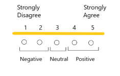
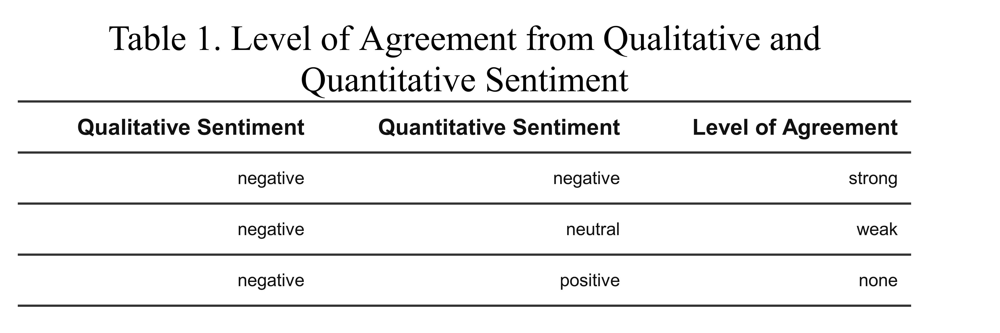
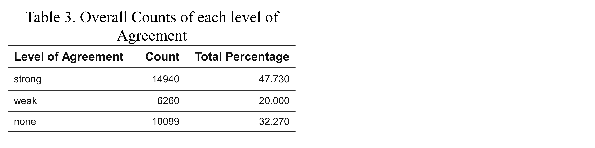

# Introduction

Quantitative studies generate data in numerical forms that can be analyzed, summarized and expressed by statistics. Qualitative studies generate data that is often not numerical and more descriptive. Generally, these forms of data are analyzed separately because they can be difficult to relate. In recent years mixed methods research has been developed to combine these types of data which can give a better overall picture of the results.  

The BC Public Service conducts a Work Environment Survey (WES) with the goals of understanding their employees' experience, celebrating their successes and identifying their areas for improvement. WES collects quantitative data through 80 multiple-choice questions and qualitative data through a single written response question "What one thing would you like your organization to focus on to improve your work environment?". 

We are investigating how the sentiment between the qualitative and quantitative data agree based on the topics addressed within the WES. This will help to determine how well the multiple-choice questions are capturing what improvements employees are wanting. We are hoping this can lead to improvement to the WES structure and ensure the voices of the employees are being heard. It may also help to give more detail and context to the multiple-choice responses. 

# Methods

To relate the sentiment of the written response question to the multiple-choice questions at the sub-theme level each multiple-choice question was given a sub-theme code. This was done by reading the multiple-choice questions and matching them to the written response sub-themes. Not all multiple-choice questions matched to a sub-theme and others questions matched to multiple sub-themes. Three independent raters coded the multiple-choice questions and inter-rater agreement was calculated. 
The comments from the written response questions all have negative sentiment that relates to the sub-theme topics. One of the sub-theme codes relates to positive comments but these do not correspond to specific topics and were filtered out of the data set. The multiple-choice questions can range from positive to negative sentiment based on a five-point rating scale.



Since there is only one written response per person with a maximum of five sub-themes to determine the level of agreement the written response sentiment was matched to the related multiple-choice questions. There are three levels of agreement strong, medium and weak as shown in table 2. 



To determine the level of agreement for the main themes the sub-themes data was aggregated and generalized. 


# Discussion

- do not start writing until inter-rater stuff done and final sub-theme mc done
- discuss sub-theme--mc matching
   - visualization to show which sub-themes appeared multiple times to which didn't at all 
   - lack of flexible work mc 


# Results & Recommendations

- summary table showing top 5 strong and top 5 weak 
 
# Literature

Wisdom J and Creswell JW. Mixed Methods: Integrating Quantitative and Qualitative Data Collection and Analysis While Studying Patient-Centered Medical Home Models. Rockville, MD: Agency for Healthcare Research and Quality. February 2013. AHRQ Publication No. 13-0028-EF

-	Talks about validating findings using qual and quant data (Wisdom & Creswell, 2013)


# Appendix


```{r setup, echo=FALSE, include=FALSE, message=FALSE}
# Require pkgs `tidyverse`, `readxl`, `testthat, `knitr`, `here`, `flextable`, `webshot` and `irr`
library(tidyverse)
library(readxl)
library(testthat)
library(flextable)
library(webshot)
library(irr)

knitr::opts_chunk$set(warning = FALSE, message = FALSE)
```


```{r load data, echo=FALSE}
# load quantitative data
path_quant <- "./data/processed/tidy_quant_questions.csv"
data_quant <- read_csv(path_quant)
# load qualitative data
path_qual <- "./data/raw/2018 WES Qual Coded - Final Comments and Codes.xlsx"
data_qual <- read_excel(path_qual, 
                    sheet = "Comments", 
                    skip = 1)
# load names/labels of qualitative sub-theme codes
qual_subtheme_labels <- read_excel(path_qual, sheet = "Codebook", 
                                   range = "B2:C75", 
                                   col_names = c("Code", "Description"))
# load sub-theme codes to question matching
path_label <- "./references/data-dictionaries/survey_mc_legend.csv"
data_label <- read_csv(path_label)

# load raters sub-theme choices for inter-rater comparison
path_inter.rater <- "./references/data-dictionaries/survey_mc_legend_inter-rater.csv"
data_legend <- read_csv(path_inter.rater)
```


```{r clean and wrangle qualitative data, include=FALSE}

# subset required columns, rename and filter out people who only had positive 
#comments
qual <- data_qual %>% 
  select(`_telkey`, `Code 1`, `Code 2`, `Code 3`, `Code 4`, `Code 5`) %>% 
  rename(USERID = `_telkey`,
         code1 = `Code 1`,
         code2 = `Code 2`,
         code3 = `Code 3`,
         code4 = `Code 4`,
         code5 = `Code 5`)

# re-organize data into tidy form
qual <- gather(qual, key= "code_num", value="code", code1, code2, code3, code4, code5)


# remove other theme and unrelated comments, create negative rating, and
# add main themes label from subtheme code
qual <- qual %>% 
  drop_na(code) %>% 
  filter(code != 99) %>% 
  filter(code != 121) %>% 
  filter(code != 123) %>% 
  filter(code != 122) %>% 
  mutate(qual_value = -1) %>% 
  select(USERID, code, qual_value)


# First Unit Test to confirm q
person1 = "172541-914038"  # 4 separate codes, all should appear = 4
person2 = "173108-219388"  # only has code 122, should NOT appear = 0
person3 = "173924-784228"  # has code 122 and 93, only code 93 should appear =1
person4 = "190199-111388"  # only has comment 99, should NOT appear =0
person5 = "180129-727518"  # has 4 codes, one being 123, so only 3 should appear =3

test1 <- qual %>% 
  filter(USERID %in% c(person1, person2, person3, person4, person5)) %>% 
  arrange(USERID)

test_that("qualitative has been properly filtered", {
  expect_equal(nrow(test1), 8)
})
```


```{r clean and wrangle quantitative data, include=FALSE}
# select the 2018 questions 
quant <- data_quant %>% 
  filter(survey_year == 2018) %>% 
  select(USERID, dplyr::matches("Q.."))  %>% 
  gather(key = "question", value="score", dplyr::matches("Q..")) %>% 
  drop_na() %>% 
  mutate(
    question = factor(question),
    quan_value = case_when(
      score < 50     ~ -1,
      score == 50    ~  0,
      score > 50     ~  1,
      TRUE           ~ 99
    )
  ) %>% 
  select(USERID, question, quan_value)

test2 <- quant %>% 
  filter(USERID %in% c(person1, person2, person3, person4, person5))

test_that("quantitative gather and filtering correctly", {
  expect_equal(nrow(test2), 393)
})

labels <- data_label %>% 
  filter(survey_year == "2018") %>% 
  filter(category == "Raw Survey Question") %>% 
  select(new_column_name, subtheme_code) %>% 
  mutate(sub_theme = (na_if(subtheme_code, 0))) %>% 
  separate(sub_theme, sep=", ", into = c("theme1", "theme2")) %>% 
  gather(key="theme_name", value="theme", theme1, theme2) %>% 
  select(theme, question = new_column_name) %>% 
  drop_na(theme) %>% 
  arrange(question)


test3 <- labels %>% 
  filter(question == "Q39")

test_that("Ensure labels have been parsed in correctly", {
  expect_equal(test3$theme, c("102",  "104"))
  expect_equal(nrow(labels), 53)
})

# join the labels with the quantititve data 
quant <- left_join(labels, quant, by=c("question")) %>% 
  select(USERID, theme,  quan_value, question) %>% 
  mutate(theme = as.numeric(theme))

test4 <- quant %>% 
  filter(USERID %in% c(person1, person2, person3, person4, person5)) %>% 
  arrange(USERID)

test5 <- quant %>% 
  filter(USERID == person1 & question == "Q01")

test6 <- quant %>% 
  filter(USERID == person1 & question == "Q17")

test7 <- quant %>% 
  filter(USERID == person1 & question == "Q41")

test_that("Ensure correct joining of subtheme codes to quant data", {
  expect_equal(nrow(test4), 258)
  expect_equal(test5$theme, 34)
  expect_equal(nrow(test6), 0)
  expect_equal(test7$theme, c(105, 106))
})
```


```{r table for agreement to sentiment, include=FALSE}
# methods table to show how sentiment relates to level of agreement
table_sent_agreement <- tribble(
  ~`Qualitative Sentiment`, ~`Quantitative Sentiment`, ~`Level of Agreement`,
                "negative",              "negative",             "strong",
                "negative",              "neutral" ,             "weak"  ,
                "negative",              "positive",             "none"
)

tb2 <- flextable(
  table_sent_agreement,
  col_keys = c("Qualitative Sentiment", 
               "Quantitative Sentiment", 
               "Level of Agreement")
              )
tb2 <- autofit(theme_vanilla(tb2))
tb2 <- set_caption(tb2, "Table 1. Level of Agreement from Qualitative and Quantitative Sentiment")
tb2 <- fontsize(tb2, part = "header", size = 10)
tb2 <- fontsize(tb2, part = "body", size = 8)
save_as_html(tb2, path = "reports/figures/table_sentiment_agreement.html")
webshot("reports/figures/table_sentiment_agreement.html", file = "reports/figures/table_sentiment_agreement.png", cliprect = c(0,0, 450, 150), zoom=10)
```


```{r combine dataframes, include=FALSE}
# combine qualitative and quanitative dfs
joined_data <- left_join(qual, quant, by=c("USERID", "code"="theme")) %>% 
  drop_na(quan_value) %>% 
  mutate(diff = quan_value - qual_value)


# join level of agreements with comments for topic modeling
comments <- data_qual %>% 
  select(USERID = `_telkey`,
         text = `2018 Comment`)
joined_comments <- left_join(joined_data, comments, by="USERID")
# create csv for topic modeling
write_csv(joined_comments, "./data/interim/joined_qual_quant.csv")
```

```{r overall summary,  echo=FALSE}
# df of subtheme overall summary
table_overall <- joined_data %>%
  group_by(diff) %>% 
  summarize(n = n()) %>%
  mutate(percent = round((n/sum(n))*100, 2),
         diff = case_when(
           diff == 0 ~ "strong",
           diff == 1 ~ "weak",
           diff == 2 ~ "none")
        ) %>% 
  select("Level of Agreement" = diff,
         "Count" = n,
         "Total Percentage" = percent)
# create table output as html, save as png and crop to desired size
tb3 <- flextable(
  table_overall,
  col_keys = c("Level of Agreement", 
               "Count",
               "Total Percentage")
              )
tb3 <- autofit(theme_vanilla(tb3))
tb3 <- set_caption(tb3, "Table 3. Overall Counts of each level of Agreement")
tb3 <- fontsize(tb3, part = "header", size = 12)
tb3 <- fontsize(tb3, part = "body", size = 10)
save_as_html(tb3, path = "reports/figures/table_subtheme_overall.html")
webshot("reports/figures/table_subtheme_overall.html", file = "reports/figures/table_subtheme_overall.png", cliprect = c(0,0, 600, 150), zoom=10)
```


```{r sub_theme summary, include=FALSE}
# create matching between theme number and name
theme_qual <- tribble(
  ~num, ~theme,
     1, "Career & Personal Development",
     2, "Compensation & Benefits",
     3, "Engagement & Workplace Culture",
     4, "Executives",
     5, "Flexible Work Environment",
     6, "Staffing Practices",
     7, "Recognition & Empowerment",
     8, "Supervisors",
     9, "Stress & Workload",
     10,"Tools, Equipment & Physical Environment",
     11, "Vision, Mission & Goals",
     12, "Other"
)

# group data for plotting and tables 
grouped_data <- joined_data %>% 
  group_by(code, diff) %>% 
  summarize(n = n()) %>% 
  arrange(code)

# create total count by sub-theme for matching below
counts <- joined_data %>%
  group_by(code) %>% 
  summarize(n = n())

# create summary table for display
table_main_theme_subtheme <- grouped_data %>% 
  mutate(perc = round(n/sum(n)*100,2)) %>% 
  select(code, diff, perc) %>% 
  spread(diff, perc) %>% 
  ungroup() %>% 
  mutate(counts = counts$n[match(`code`, counts$code)],
         main_theme = str_sub(`code`, start = 1, end = str_length(`code`)-1),
         Theme = theme_qual$theme[match(`main_theme`, theme_qual$num)],
         code = as.character(`code`)) %>% 
  select(Theme,
         "Sub-theme" = code,
         "Total Number" = counts,
         "Strong Agreement (%)" = "0",
         "Weak Agreement (%)" = "1",
         "No Agreement (%)" = "2")  
 
```

```{r, echo=FALSE}
# generate report quality table in html then to png
tb4 <- flextable(
  table_main_theme_subtheme,
  col_keys = c("Theme", 
               "Sub-theme", 
               "Total Number", 
               "Strong Agreement (%)",
               "Weak Agreement (%)", 
               "No Agreement (%)")
              )
tb4 <- merge_v(tb4, j="Theme")
tb4 <- autofit(theme_vanilla(tb4))
tb4 <- fontsize(tb4, part = "header", size = 16)
tb4 <- fontsize(tb4, part = "body", size = 14)
tb4 <- set_caption(tb4, "Table 4. Themes and Subtheme Level of Agreement")
save_as_html(tb4, path = "reports/figures/table_maintheme_subtheme.html")
webshot("reports/figures/table_maintheme_subtheme.html", file = "reports/figures/table_maintheme_subtheme.png", cliprect = c(0,0, 850, 850), zoom=10)
```


```{r figure 1, echo=FALSE, fig.height=7.5}
# add main theme labels to grouped data
group2 <- grouped_data %>% 
  mutate(main_theme = str_sub(`code`, start = 1, end = str_length(`code`)-1),
         Theme = theme_qual$theme[match(`main_theme`, theme_qual$num)])
# shows distribution of agreement for each subtheme
ggplot(data=group2) +
  geom_col(aes(x=factor(diff), y=n, fill=Theme)) +
  facet_wrap(~code) +
  labs(x="", y="count", fill="") +
  ggtitle("Figure 1. Distribution of Agreement per Subtheme") +
  theme_bw()+
  scale_fill_brewer(type="qual", palette = "Paired") +
  theme(legend.position="bottom",
        axis.text.x = element_text(angle=70, hjust = 1)) +
  guides(fill=guide_legend(nrow=4)) +
  scale_x_discrete(labels=c("0" = "Strong", "1" = "Weak",
                              "2" = "None"))
```

```{r figure 2, echo=FALSE}
# group data by main themes
general_theme <- group2 %>% 
  ungroup() %>% 
  select(Theme, diff, n) %>% 
  group_by(Theme, diff) %>% 
  summarize(counter = sum(n))
# proportions of agreeement by theme
ggplot(data=general_theme) +
  geom_bar(aes(x=Theme, y=counter, fill=factor(diff)), 
           stat = "identity", 
           position = "fill") +
  labs(fill="Level of Agreement", x="", y="") +
  ggtitle("Figure 2.Proportions of Agreeement by Qualitative Theme") +
  theme_bw() +
  theme(axis.text.x = element_text(angle=70, hjust = 1)) +
  scale_fill_brewer(type="qual", 
                    palette = "Set2", 
                    labels=c("0" = "Strong", 
                             "1" = "Weak", 
                             "2" = "None"))
```




```{r inter-rater calculations,  echo=FALSE}
# column index 
# ayla = 3
# aaron = 4
# fan = 5

# fan vs aaron
fan_aaron <- kappa2(data_legend[,4:5])
# ayla vs aaron
ayla_aaron <- kappa2(data_legend[,3:4])
# fan vs ayla 
df <- tibble("ayla"=data_legend$ayla, "fan"=data_legend$fan)
fan_ayla <- kappa2(df)

# n raters (for all 3 of us)
all_inter_rater <- kappam.fleiss(data_legend[,3:5])
# create table to display results
table_inter_rater <- tibble("Raters" = c("Fan & Aaron", 
                                         "Fan & Ayla", 
                                         "Ayla & Aaron", 
                                         "All"),
                            "Kappa" = c(fan_aaron$value, 
                                        fan_ayla$value, 
                                        ayla_aaron$value, 
                                        all_inter_rater$value)) %>% 
  mutate(Kappa = round(Kappa, 2))
# create presentation quality table
tbl_inter <- flextable(
  table_inter_rater,
  col_keys = c("Raters", 
               "Kappa")
              )
tbl_inter <- autofit(theme_vanilla(tbl_inter))
tbl_inter <- set_caption(tbl_inter, "Table 5. Themes and Subtheme Level of Agreement")
save_as_html(tbl_inter, path = "reports/figures/table_inter-rater.html")
webshot("reports/figures/table_inter-rater.html", file = "reports/figures/table_inter-rater.png", cliprect = c(0,0, 600, 200), zoom=10)

# need to webshot and what not to display
# think about how to tweak
# maybe remove some of Fan's results so they are more conservative
# group to main themese or something 
# def talk about how there are over 60's groups so no adjustment was used because chance agreement here is much lower then when there are binary classes
```


```{r sub-theme appendix, include=FALSE}
# appendix table showing subtheme codes and descriptions
appendix_subtheme <- qual_subtheme_labels %>% 
  filter(!Description %in% (theme_qual$theme)) %>% 
  mutate(main_theme = str_sub(`Code`, start = 1, end = str_length(`Code`)-1),
         Theme = theme_qual$theme[match(`main_theme`, theme_qual$num)],
         Theme = if_else(Code == 99, "", Theme) , 
         Code = as.integer(Code),
         Description = str_replace_all(Description, "_", " ")
         ) %>% 
  select(Theme, Code, Description)
# generate png 
appx <- flextable(
  appendix_subtheme,
  col_keys = c("Theme", 
               "Code",
               "Description")
              )
appx <- merge_v(appx, j="Theme")
appx <- autofit(theme_vanilla(appx))
appx <- set_caption(appx, "Appendix 1. Subtheme Code Descriptions")
appx <- fontsize(appx, part = "header", size = 12)
appx <- fontsize(appx, part = "body", size = 10)
save_as_html(appx, path = "reports/figures/appendix_subtheme_desc.html")
webshot("reports/figures/appendix_subtheme_desc.html", file = "reports/figures/appendix_subtheme_desc.png", zoom=10)


# split into 2 webshots due to table length
# webshot("reports/figures/appendix_subtheme_desc.html", file =   "reports/figures/appendix_subtheme_desc1.png", cliprect = c(0,0, 600, 600), zoom=10)
#webshot("reports/figures/appendix_subtheme_desc.html", file = "reports/figures/appendix_subtheme_desc2.png", cliprect = c(500,0, 600, 1000), zoom=10)


```


```{r knit file, , include=FALSE}
# uncomment and run

# output_path <- here::here("reports")
# rmarkdown::render(input = "notebooks/ap_qual_to_quant_subtheme_model.Rmd",
#                   knit_root_dir = "..",
#                  output_dir = output_path,
#                  output_file = "ap_report",
#                  output_format = "pdf_document")
```


## Comments and To do's

- write some more unit tests/double check filter conditions

- find references for intro section/put them in

- why does img html tag have to go from back to render properly 

- need to look into why some don't agree

- need to create vis/table to show sub-themes to mc relation


# Exploratory Work 

- may be moved to be inbetween things once complete


```{r, include=FALSE}
joined_data %>% 
  filter(code == 81) %>% 
  filter(diff == 0)


joined_data %>% 
  group_by(code) %>% 
  summarize(n=n()) %>% 
  arrange(desc(n))


table_main_theme_subtheme %>% 
  select(-Theme) %>% 
  arrange(desc(`Total Number`))


table_main_theme_subtheme %>% 
  select(-Theme) %>% 
  arrange(desc(`Total Number`))


table_main_theme_subtheme %>% 
  select(-Theme) %>% 
  arrange(desc(`Weak Agreement (%)`)) %>% 
  select(`Sub-theme`, `Weak Agreement (%)`, `Total Number`)


quant %>% 
  filter(USERID == "194806-463202") %>% 
  arrange(desc(theme, question)) 

# 190921-405038	81	-1	-1	Q51	0
# 193255-532574	81	-1	-1	Q51	0
# 176425-344498	81	-1	-1	Q49	0
# 176425-344498	81	-1	-1	Q51	0
# 180172-183464	81	-1	-1	Q51	0
# 194371-594950	81	-1	-1	Q49	0
# 194371-594950	81	-1	-1	Q51	0
# 192066-223518	81	-1	-1	Q49	0
# 192066-223518	81	-1	-1	Q51	0
# 192466-096134	81	-1	-1	Q49
# 192466-096134	81	-1	-1	Q51	0

# a <- quals %>% 
#   filter(`_telkey` == "192466-096134")
#   
# a$`2018 Comment`
# 
# joined_data %>% 
#   filter(USERID == "192466-096134")

```


```{r create vis to show sub-theme question match}
labels %>% 
  group_by(theme) %>% 
  summarise(number_of_subthemes_per_Q = n()) %>% 
  arrange(number_of_subthemes_per_Q) %>% 
  count(number_of_subthemes_per_Q)
```


